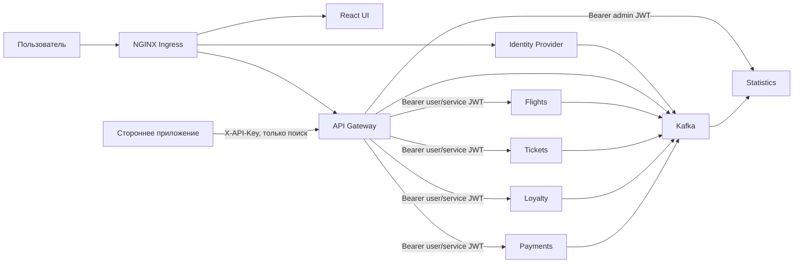

# Архитектура прототипа

## Границы сервисов и данные

| Компонент | Ответственность | Собственное хранилище | Внешний доступ |
|---|---|---|---|
| `web` | React UI, OIDC PKCE-клиент | нет | Ingress `/` |
| `idp` | пользователи, профили, OIDC/OAuth 2.0 | `identity.db`, RSA private key | Ingress `/oauth2`, `/.well-known` |
| `gateway` | BFF, агрегация, orchestration, partner API | нет | Ingress `/api`, `/partner` |
| `flights` | расписание, подсказки городов, карта мест и атомарный остаток мест | `flights.db` | только кластер |
| `tickets` | бронирования пользователя, данные пассажира, багаж, онлайн-регистрация | `tickets.db` | только кластер |
| `loyalty` | счёт и операции бонусов | `loyalty.db` | только кластер |
| `payments` | sandbox-платежи и идемпотентность | `payments.db` | только кластер |
| `statistics` | Kafka consumer и отчёты | `statistics.db` | только кластер |

PVC монтируется только в соответствующий pod. Ни один доменный сервис не получает путь, credentials или сетевой endpoint чужой БД.

## Потоки запросов

Публичный поиск по городам (`origin_city` / `destination_city`) и подсказки городов не означают анонимный межсервисный вызов: Gateway получает у IdP токен по `client_credentials`, а затем вызывает Flights с Bearer JWT. Выбор посадочного места также обслуживается Flights: Gateway сначала резервирует конкретные места, а затем создаёт запись в Tickets с персональными данными пассажира и выбранным багажом. Пользовательские операции пересылают пользовательский access token. Все сервисы проверяют `iss`, `aud`, подпись RS256, срок и scopes по JWKS.

## OIDC

IdP реализует регистрацию пользователей, discovery, JWKS, Authorization Code + PKCE S256, refresh token, client credentials и UserInfo. Для пользователя регистрация доступна через публичный Gateway, но межсервисный вызов Gateway → IdP `/users` выполняется только с сервисным JWT и scope `users:write`. Authorization code одноразовый и хранится только в виде SHA-256; redirect URI сверяется с allowlist. Пароли хешируются `scrypt`; access/id tokens подписываются RSA-2048.

## Ошибки и деградация

- Общий middleware на каждом FastAPI-сервисе присваивает или пробрасывает `X-Request-ID`, возвращает ошибки в едином JSON-формате и публикует события `http_request`, `validation_error`, `unhandled_error`.
- В аудит HTTP-запросов попадают метод, путь, статус, длительность, `request_id`, а после успешной проверки JWT — `subject` и `role`. Это позволяет связать действие с пользователем, сервисным клиентом или администратором.
- Если создание брони не удалось после резерва места, Gateway выполняет `release` (compensating transaction).
- Онлайн-регистрация доступна только для оплаченных (`confirmed`) броней; повторный check-in идемпотентно возвращает уже зарегистрированную бронь.
- Если Loyalty недоступен после успешной оплаты, билет остаётся подтверждённым, клиент получает предупреждение о позднем начислении.
- Dashboard собирает Tickets, Loyalty и Payments параллельно; отказ одного некритичного виджета не ломает остальные.
- Подсказки городов считаются некритичным функционалом: если Flights недоступен, Gateway возвращает пустой список с `degraded: true`, а пользователь может продолжить ручной ввод.
- Недоступность Kafka не блокирует пользовательские запросы: событие остаётся в структурированном приложенческом логе. Для production следующий шаг — transactional outbox.
- Payment API использует `Idempotency-Key`, поэтому повтор запроса не создаёт вторую оплату.

## Статистика и отчёты

Statistics service является единственным потребителем Kafka-аудита в прототипе. Он сохраняет события в собственную `statistics.db`, не обращаясь к БД других сервисов, и строит агрегированный отчёт по периоду: количество событий по сервисам, действиям и HTTP-статусам. Доступ к отчёту (`/reports/summary`, `/reports/summary.csv` через Gateway `/api/admin/report`) требует admin JWT со scope `stats:read`.

## Что является прототипным ограничением

SQLite + один replica для stateful-доменов выбраны для компактного запуска. Для production следует заменить каждую БД отдельным экземпляром/схемой PostgreSQL со своими credentials, private key IdP вынести в KMS/Secret, добавить outbox/retry/DLQ, rate limiting, TLS и полноценный платёжный провайдер.
